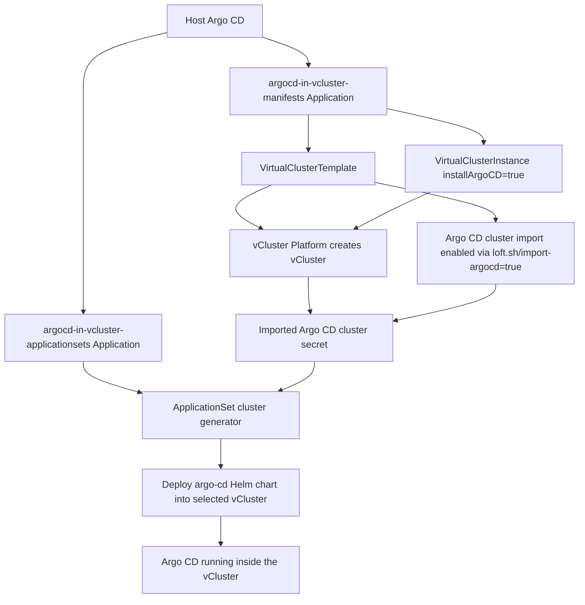

# Argo CD Inside vCluster with Virtual Cluster Templates

This use case creates a vCluster from a `VirtualClusterTemplate`, imports that vCluster into the host Argo CD instance through the vCluster Platform Argo CD integration, and then uses an Argo CD `ApplicationSet` to install a dedicated Argo CD instance inside the vCluster.

## Overview

This is a two-level GitOps pattern:

- The host-cluster Argo CD instance manages the vCluster template and the vCluster instance.
- The host-cluster Argo CD instance also sees the new vCluster as a destination cluster because the template enables Argo CD import.
- An `ApplicationSet` running in the host-cluster Argo CD selects that imported cluster and deploys the `argo-cd` Helm chart into the vCluster.

The result is a bootstrap Argo CD on the host cluster and an isolated Argo CD installation running inside the tenant or demo vCluster.

## Flow Diagram

## Manifest Breakdown

[`manifests/argocd-in-vcluster-template.yaml`](./manifests/argocd-in-vcluster-template.yaml) defines the `VirtualClusterTemplate`.

- `loft.sh/import-argocd: 'true'` enables Argo CD cluster import for vClusters created from this template.
- The template adds instance labels including `addons.vcluster.demo/argocd`, `vcluster.demo/namespace`, `vcluster.demo/project`, and `vcluster.demo/owner`.
- Those labels are propagated to the imported Argo CD cluster secret and become usable by the `ApplicationSet` cluster generator.
- The template also enables ingress sync to the host, embedded etcd, embedded CoreDNS, and custom links for the Argo CD endpoint.

[`manifests/argocd-in-vcluster-instance.yaml`](./manifests/argocd-in-vcluster-instance.yaml) creates a `VirtualClusterInstance` from that template.

- It references template version `1.0.x`.
- It sets `installArgoCD: true`.
- That value drives the `addons.vcluster.demo/argocd` label rendered by the template, which is the selector used later by the `ApplicationSet`.

[`apps/argocd-in-vcluster-manifests.yaml`](./apps/argocd-in-vcluster-manifests.yaml) is the host Argo CD `Application` that syncs the template and instance manifests into the management cluster.

[`apps/argocd-in-vcluster-applicationsets.yaml`](./apps/argocd-in-vcluster-applicationsets.yaml) is the host Argo CD `Application` that syncs the `ApplicationSet` definitions.

[`applicationsets/argocd-in-vcluster-cluster-gen.yaml`](./applicationsets/argocd-in-vcluster-cluster-gen.yaml) contains the logic that installs Argo CD inside the imported vCluster.

- It uses the Argo CD `clusters` generator.
- It selects only imported clusters labeled `addons.vcluster.demo/argocd: "true"`.
- For every matching cluster, it creates an `Application` named `argocd-{{.name}}`.
- That generated `Application` installs the `argo-cd` Helm chart into the `argocd` namespace of the selected vCluster.
- The Argo CD server ingress hostname is derived from `vcluster.demo/namespace`, so the endpoint is tied to the vCluster namespace created by the template.

## Why This Works

The key mechanism is the label handoff between vCluster Platform and Argo CD:

1. The template enables Argo CD import and stamps metadata onto the vCluster instance.
2. vCluster Platform creates or updates the Argo CD cluster secret for that vCluster.
3. The `ApplicationSet` cluster generator filters those secrets by label.
4. Matching vClusters automatically receive their own Argo CD installation.

This makes Argo CD installation an opt-in add-on controlled by the vCluster template parameter instead of a separate manual bootstrap step.
